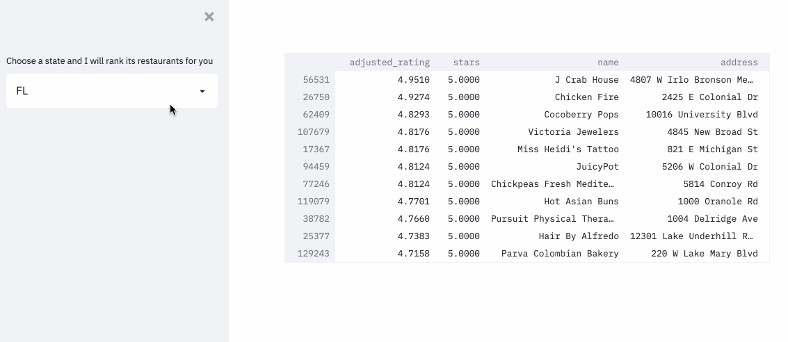

# Bayesian Rater

This is a project where I attempt to solve the age-old problem that comes with online shopping
using **Bayesian Statistics**.

So, which one of the following item is better?
- A pair of glasses from a major brand A with an average rating of 4.1 from 1000 users
- Another pair of glasses from a start-up with an average rating of 4.5 from 16 users

In this repo, I solved the above problem using PyMC3(Glasses 1 are better if you're curious!)
and built a [demo](https://share.streamlit.io/raychn1997/bayesian-rater/main.py) 
where restaurants are ranked using an approximation formula using the
[yelp dataset](https://www.yelp.com/dataset/documentation/main)!

